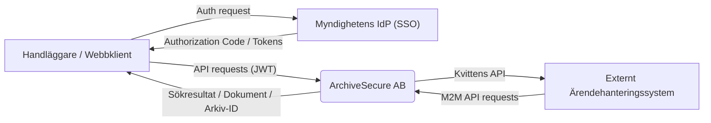
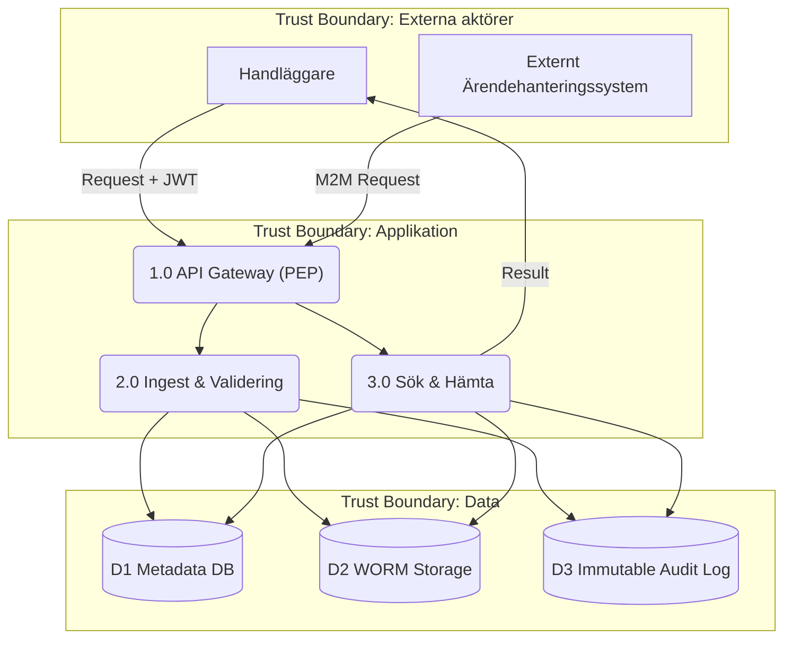
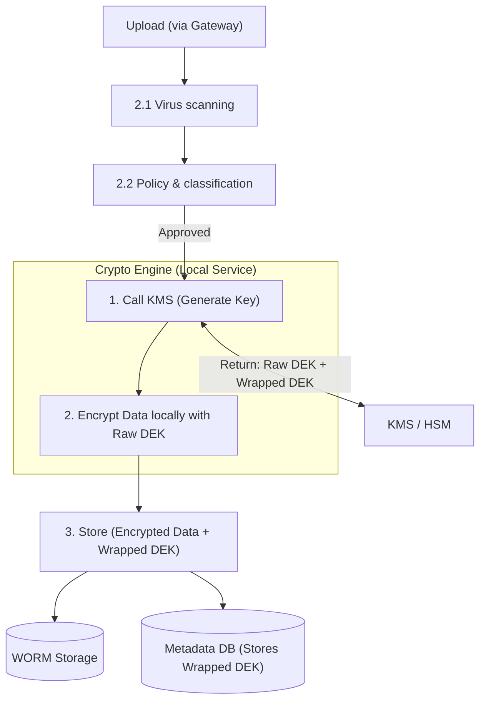

# Dataflödesdiagram (DFD)

Dataflödesdiagrammen kartlägger hur information rör sig genom systemet, var den lagras och vilka aktörer som interagerar med den. För att identifiera hot (vilket görs i nästa fas med STRIDE) har vi markerat viktiga Trust Boundaries (tillitsgränser) där data passerar från en säkerhetszon till en annan.
DFD Level 0: Kontextdiagram

Level 0 ger ett helikopterperspektiv. Det visar hela systemet som en enda process och belyser vilka externa parter som systemet kommunicerar med.

Level 0 beskriver ArchiveSecure som ett centralt arkivsystem som hanterar både interaktiva användare (handläggare) och externa systemintegrationer.

Autentisering sker via en extern Identity Provider (IdP) som utfärdar säkerhets-tokens baserade på OIDC/SAML. Dessa tokens används av klienter för att autentisera API-anrop mot ArchiveSecure-systemet.

Systemet returnerar antingen sökresultat, arkivdokument eller arkivkvitton beroende på operationstyp.

## DFD Level 1: Huvudprocesser

Level 1 bryter ner systemet i dess huvudsakliga logiska processer och visar var data lagras. Här blir tillitsgränserna mellan externa användare och vår interna logik tydlig.

Level 1 bryter ner systemet i tre huvudkomponenter:

- API Gateway (Policy Enforcement Point)
- Ingest & Validering (arkivering av data)
- Sök & Hämtning (åtkomst till arkivdata)

All extern trafik passerar API Gateway, där autentisering och auktorisering sker innan vidare routing till interna tjänster.

Systemet är uppdelat i tre separata datazoner:

- Metadata lagras i en krypterad databas
- Dokument lagras i oföränderlig WORM-lagring
- Alla operationer loggas i en immutable audit log

Detta säkerställer spårbarhet, dataintegritet och skydd mot manipulation.

## DFD Level 2: Detaljerat flöde för Arkivering (Ingest)

Level 2 zoomar in på en specifik, affärskritisk process. Här tittar vi på vad som händer internt i "2.0 Ingest & Validering" när ett nytt, känsligt dokument laddas upp till e-arkivet. Detta flöde är kritiskt för att säkerställa att ingen skadlig kod kommer in och att datan krypteras innan den når lagringen.

Processen startar när en validerad request når ingest-tjänsten via API Gateway.

Följande steg sker:

1. Filen skannas för skadlig kod och filformatvalideras.
Policy engine verifierar att användaren har rätt att arkivera datan.
2. En Data Encryption Key (DEK) tillhandahålls via Key Management System (KMS).
3. Dokumentet krypteras
4. Krypterad data lagras i WORM storage och metadata sparas i databasen.
5. Alla steg loggas i en immutable audit log för spårbarhet.

Om någon kontroll misslyckas avbryts processen och en säkerhetsincident loggas.

Här krypterar vi med vår publika nyckel och när vi ska ta ut den dekrypterar vi med våran privata nyckel