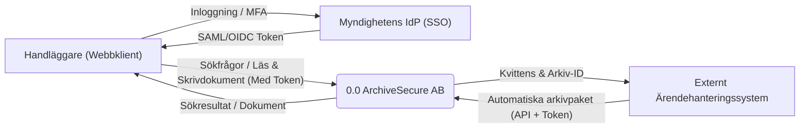
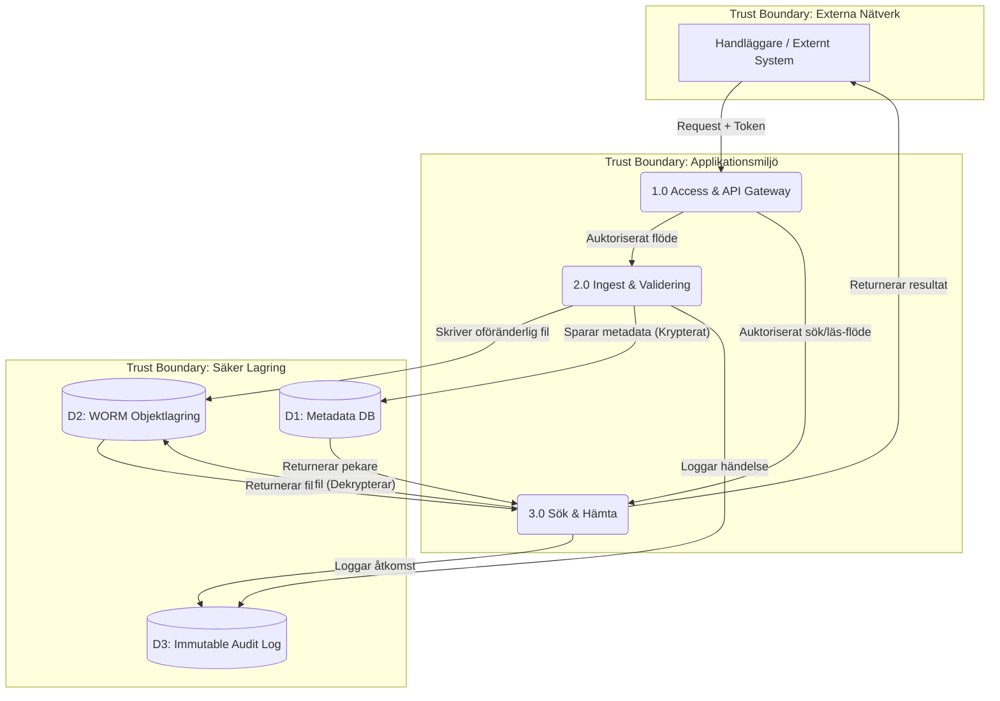
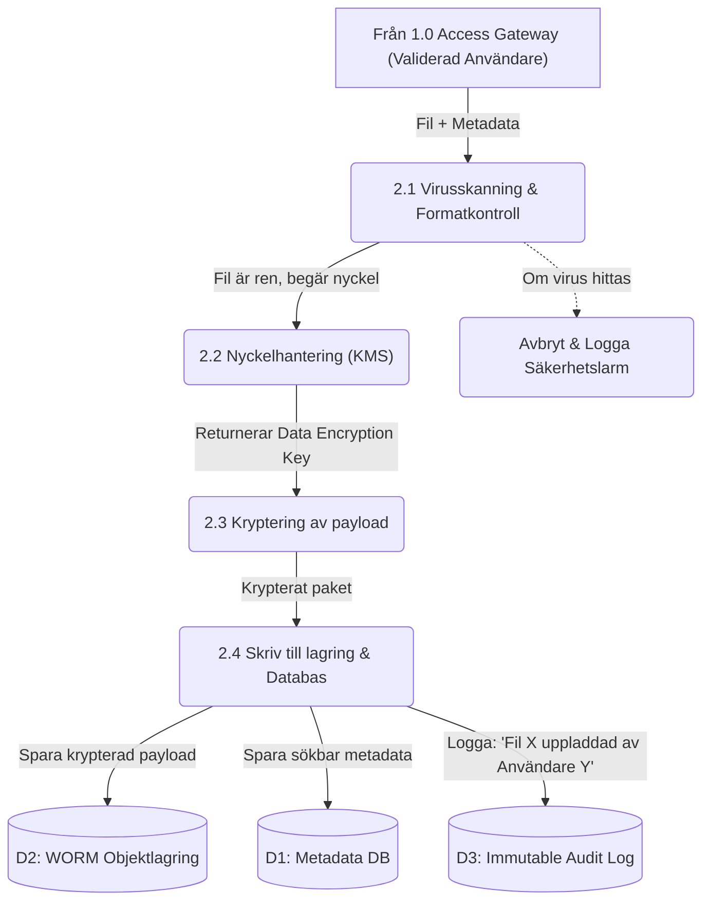

# Dataflödesdiagram (DFD)

Dataflödesdiagrammen kartlägger hur information rör sig genom systemet, var den lagras och vilka aktörer som interagerar med den. För att identifiera hot (vilket görs i nästa fas med STRIDE) har vi markerat viktiga Trust Boundaries (tillitsgränser) där data passerar från en säkerhetszon till en annan.
DFD Level 0: Kontextdiagram

Level 0 ger ett helikopterperspektiv. Det visar hela systemet som en enda process och belyser vilka externa parter som systemet kommunicerar med.

## DFD Level 1: Huvudprocesser

Level 1 bryter ner systemet i dess huvudsakliga logiska processer och visar var data lagras. Här blir tillitsgränserna mellan externa användare och vår interna logik tydlig.

## DFD Level 2: Detaljerat flöde för Arkivering (Ingest)

Level 2 zoomar in på en specifik, affärskritisk process. Här tittar vi på vad som händer internt i "2.0 Ingest & Validering" när ett nytt, känsligt dokument laddas upp till e-arkivet. Detta flöde är kritiskt för att säkerställa att ingen skadlig kod kommer in och att datan krypteras innan den når lagringen.

