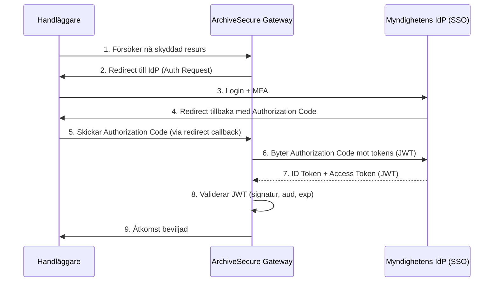

# IAM-design (Identity & Access Management)

För ArchiveSecure AB implementerar vi en modern IAM-modell baserad på Zero-Trust. Detta innebär att vi inte litar på någon inne i nätverket per automatik; varje anrop måste vara autentiserat och auktoriserat.
5.1 Autentiseringsflöde (OIDC-baserat)

Vi använder en standardiserad OIDC-process för att säkerställa att användaridentiteten är verifierad av myndighetens egen katalogtjänst.



## Auktoriseringsmodell (RBAC + ABAC)

För att hantera komplexa myndighetskrav kombinerar vi två modeller:

| Modell | Syfte | Exempel |
|--------|--------|---------|
| RBAC | Definiera vad man får göra. | Rollen ARKIV_ADMIN får radera loggar; HANDLÄGGARE får bara läsa/skriva. |
| ABAC | Definiera vilken data man får se. | Handläggare får endast läsa dokument där OrgUnit == 'Kommun_X' och Sekretessklass <= 'Normal'. |


Implementationsstrategi

    Claims-baserad auktorisering: När användaren loggar in skickar IdP:n med "claims" (attribut) i JWT-token, t.ex. department_id, clearance_level.

    Policy Enforcement Point (PEP): API Gatewayen fungerar som en grindvakt som nekar alla anrop som saknar giltig token eller som försöker nå resurser utanför sina attribut.

    Policy Decision Point (PDP): En mikrotjänst (ex. Open Policy Agent - OPA) utvärderar om användaren med sina attribut har rätt att utföra den specifika handlingen på ett specifikt objekt.


en jwt token kan t.ex se ut såhär:

```json
{
  "sub": "user123",
  "org_unit": "Kommun_X",
  "clearance_level": "Secret",
  "iat": 1719590000
}
```