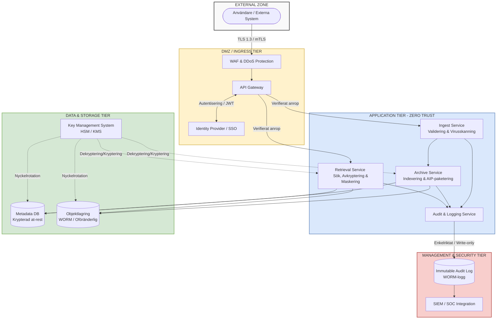

## Systemöversikt: ArchiveSecure AB

ArchiveSecure AB är ett fiktivt, hög-säkert e-arkivsystem utformat för kommuner och statliga myndigheter. Systemet möjliggör långtidslagring (10–50 år) av känsliga dokument och strukturerad data i enlighet med offentlighets- och sekretesslagen (OSL), GDPR, arkivlagen samt kraven i NIS2-direktivet.

Lösningen bygger på en modern mikrotjänstarkitektur där all kommunikation och dataåtkomst styrs av Zero-Trust-principer. Det innebär att inget internt nätverk är implicit betrott och att varje transaktion kräver explicit autentisering och auktorisering.

Huvudanvändare och Aktörer:

    Handläggare (Läs/Skriv): Myndighetspersonal som arkiverar och söker fram dokument.

    Systemadministratörer (Drift): Hanterar plattformens hälsa och infrastruktur.

    Säkerhetsadministratörer / CISO: Granskar audit-loggar, hanterar incidenter och säkerhets-policies.

    Externa Verksamhetssystem (Maskin-till-Maskin): Diarieföringssystem och ärendehanteringssystem som integrerar via API för automatiserad arkivering.

### Övergripande Arkitektur

Arkitekturen är uppdelad i strikta säkerhetszoner för att minimera attackytan och förhindra lateral förflyttning (lateral movement) vid ett eventuellt intrång.

Komponentbeskrivning

    WAF & API Gateway: Terminerar extern trafik, skyddar mot OWASP Top 10-attacker och rate-limitar anrop.

    Identity Provider (IdP): Hanterar all autentisering via OIDC/SAML2 mot myndigheternas egna katalogtjänster. Kräver multifaktorautentisering (MFA).

    Objektlagring (WORM): Den faktiska lagringen av filerna konfigureras med Write Once Read Many-lås på hårdvaru- eller molnnivå för att garantera att arkiverad data inte kan manipuleras, ens av en administratör, under den lagstadgade bevarandetiden.

    Key Management System (KMS): Hanterar livscykeln för de kryptografiska nycklar som används för att kryptera både metadata och dokument at-rest.

### Kritiska Tillgångar (Key Assets)

För att säkerställa att vi applicerar rätt säkerhetskontroller måste vi definiera vad vi skyddar. Följande tillgångar utgör kärnan i ArchiveSecure AB:s skyddsvärde.
Informationstillgångar

    Arkivobjekt (Dokument/Filer): Den primära tillgången. Kan innehålla allt från offentliga protokoll till djupt sekretessklassad information (exempelvis individärenden inom socialtjänsten).

    Arkivmetadata: Beskrivande data (vem, vad, när, varför) kopplat till dokumenten. Innehåller ofta personuppgifter och är affärskritisk för sökbarhet.

    Personuppgifter (PII): Förekommer i både dokument, metadata och användarkonton. Skyddas primärt på grund av GDPR-krav.

System- och Infrastrukturtillgångar

    Kryptografiska Nycklar (Root & Data Encryption Keys): Om dessa komprometteras förloras antingen sekretessen för all data, eller så förloras tillgängligheten (kryptografisk radering). Den absolut mest kritiska tekniska tillgången.

    Audit Logs (Spårbarhetsloggar): Oföränderliga loggar som bevisar vem som har läst, lagt till eller försökt manipulera data. Kritiskt ur ett bevis- och GRC-perspektiv (Governance, Risk, Compliance).

    IAM-reglerverk (Auktoriseringsmatriser): Reglerna som definierar vilken myndighet eller handläggare som har åtkomst till vilka arkivbildare